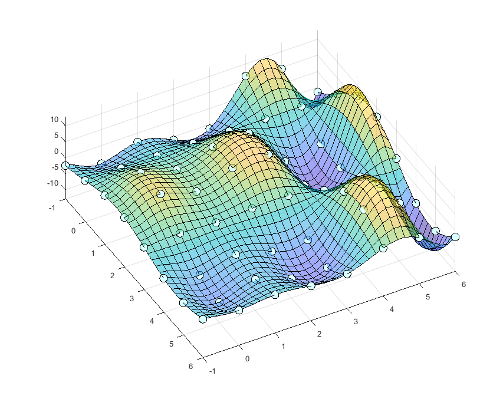

<a name="readme-top"></a>

<!--
*** Thanks for checking out the Best-README-Template. If you have a suggestion
*** that would make this better, please fork the repo and create a pull request
*** or simply open an issue with the tag "enhancement".
*** Don't forget to give the project a star!
*** Thanks again! Now go create something AMAZING! :D
-->

<!-- PROJECT SHIELDS -->
<!--
*** I'm using markdown "reference style" links for readability.
*** Reference links are enclosed in brackets [ ] instead of parentheses ( ).
*** See the bottom of this document for the declaration of the reference variables
*** for contributors-url, forks-url, etc. This is an optional, concise syntax you may use.
*** https://www.markdownguide.org/basic-syntax/#reference-style-links
-->

<!-- PROJECT LOGO -->
<br />
<div align="center">
  <a>
    
  </a>
  <h3 align="center">ndimsplinejax</h3>
  A multidimensional spline interpolation by Google/JAX

</div>

<!-- TABLE OF CONTENTS -->
<details>
  <summary>Table of Contents</summary>
  <ol>
    <li>
      <a href="#about-the-project">About The Project</a>
    </li>
    <li>
      <a href="#getting-started">Getting Started</a>
      <ul>
        <li><a href="#prerequisites">Prerequisites</a></li>
        <li><a href="#installation">Installation</a></li>
      </ul>
    </li>
    <li><a href="#usage">Usage</a></li>
    <li><a href="#jupyter notebook version">Jupyter Notebook version</a></li>
    <li><a href="#license">License</a></li>
    <li><a href="#contact">Contact</a></li>
    <li><a href="#acknowledgments">Acknowledgments</a></li>
  </ol>
</details>

<!-- ABOUT THE PROJECT -->

## About The Project

Interpolant is by definition an efficiently-computable mathematical function
that models a discrete dataset. The interpolant is, for example, needed to
reflect an experimental/observational data to a computational scheme in
numerical simulations or statistical predictions. There have been many
interpolation code/software available; however, I didn't find any
multidimensional interpolant compatible with both Just-In-Time compilation and
Automatic Differentiation. In my research, I needed such interpolant for
applying a recent Hamiltonian-MC scheme, which requires JIT and Autograd -able
likelihood function, to my Bayesian inverse problem wherein the forward model is
only accessible through a discrete look-up table. So, I decided here to develop
a code for JIT and Autograd -able interpolant. I'd like to share the developed
codes hoping they are useful for various scientists and engineers.

### Functionalities:

- `SplineCoefs_from_GriddedData` module computes the natural-cubic spline
  coefficients of the interpolant from the scalar y data distributed on a
  N-dimensional Cartesian x grid.
- `SplineInterpolant` module generates an JIT & Autograd compatible interpolant
  from the spline coefficients.
- On each dimensional axis, x grid-points must be equidistant. The grid-points
  interval can be different among axes.
- Current version supports 1, 2, 3, 4, 5 dimensional x space (N<=5).

#### Comments:

- The author thinks the requirement of "equidistant grid-points on each axis"
  would not be a serious limitation in practice. A user can project/approximate
  a non-equidistant gridded data to equidistant gridded data by an mathematical
  transformation of each variable.
- The code execution in higher dimensions/finer grids can be restricted by
  affordable memory and the computation time.

<p align="right">(<a href="#readme-top">back to top</a>)</p>

<!-- GETTING STARTED -->

## Getting Started

This is an example of how you use the modules on your local computer.

### Prerequisites

- An execution environment of Python3 on Linux, MacOS, or WSL2 on Windows
- `numpy`, `scipy`, and `jax` modules
- Update the Python3 and modules to the latest stable version (recommended).
<p align="right">(<a href="#readme-top">back to top</a>)</p>

### Installation

```sh
git clone https://github.com/nmoteki/ndimsplinejax.git
```

<p align="right">(<a href="#readme-top">back to top</a>)</p>

### Usage

Here is the workflow for an example of 5-dimensional x-space (N=5):

1. Define the grid information. For x-coordinates, we define the N-list of lower
   bounds `a`, the N-list `b` of upper bounds, and the N-list `n` of number of
   grid intervals.
   ```py
   a = [
       0,
       0,
       0,
       0,
       0,
   ]  # the user-defined lower bound of each x-coordinate [1st dim, ..., Nth dim]
   b = [
       1,
       2,
       3,
       4,
       5,
   ]  # the user-defined upper bound of each x-coordinate [1st dim, ..., Nth dim]
   n = [
       10,
       10,
       10,
       10,
       10,
   ]  # the user-defined number of grid intervals in each x-coordinate [1st dim, ..., Nth dim]
   ```
2. Prepare an observation data `y_data` on the x gridpoints.

   ```py
   N = len(a)  # dimension N

   # Make an N-tuple of numpy arrays of x-gridpoint values
   x_grid = ()
   for j in range(N):
       x_grid += (np.linspace(a[j], b[j], n[j] + 1),)

   # Make an N-dimensional numpy array of y_data
   grid_shape = ()
   for j in range(N):
       grid_shape += (n[j] + 1,)
   y_data = np.zeros(grid_shape)

   # A synthetic y_data (should be replaced by a user-defined data in actual use):
   for q1 in range(n[0] + 1):
       for q2 in range(n[1] + 1):
           for q3 in range(n[2] + 1):
               for q4 in range(n[3] + 1):
                   for q5 in range(n[4] + 1):
                       y_data[q1, q2, q3, q4, q5] = (
                           np.sin(x_grid[0][q1])
                           * np.sin(x_grid[1][q2])
                           * np.sin(x_grid[2][q3])
                           * np.sin(x_grid[3][q4])
                           * np.sin(x_grid[4][q5])
                       )
   ```

3. Compute the spline coefficients from data, using the
   `SplineCoefs_from_GriddedData` module.

   ```py
   # import the module.
   from SplineCoefs_from_GriddedData import SplineCoefs_from_GriddedData

   # Make an instance of the class SplineCoefs_from_GriddedData
   spline_coef = SplineCoefs_from_GriddedData(a, b, y_data)

   # Compute the spline coefficients c_i1...iN
   # (The author recommend a name of the coefficients matrix to be N-explicit for readability)
   c_i1i2i3i4i5 = spline_coef.Compute_Coefs()
   ```

4. Generate the JIT & AD -able interpolant from the coefficients, using the
   `SplineInterpolant` module.

   ```py
   # import the module.
   from SplineInterpolant import SplineInterpolant

   # compute the jittable and auto-differentiable interpolant using the spline coefficient c_i1i2i3i4i5.
   spline = SplineInterpolant(a, b, n, c_i1i2i3i4i5)
   ```

5. Use the generated interpolant with the `jax`'s JIT & Autograd
   functionalities.

   ```py
   import jax.numpy as jnp
   from jax import jit, grad, value_and_grad

   # Specify a x-coordinate for function evaluation as a jnp array.
   x = jnp.array(
       [0.7, 1.0, 1.5, 2.0, 2.5]
   )  # By definition, x must satisfy the elementwise inequality a <= x <= b.

   # call the method of 5-dimentional interpolant s5D of the "spline" instance (without JIT)
   print(
       spline.s5D(x)
   )  # for N-dimension, please call sND method (N is either of 1,2,3,4,5)

   # Compute the automatic gradient of spline.s5D(x) at the specified x-coordinate
   ds5D = grad(spline.s5D)
   print(ds5D(x))

   # Compute both value and gradient of spline.s5D(x) at the specified x-coordinate
   s5D_fun = value_and_grad(spline.s5D)
   print(s5D_fun(x))

   # Jitted version of spline.s5D(x) at the specified x-coordinate
   s5D_jitted = jit(spline.s5D)
   print(s5D_jitted(x))

   # Compute the jitted automatic gradient of spline.s5D(x) at the specified x-coordinate
   ds5D_jitted = jit(grad(spline.s5D))
   print(ds5D_jitted(x))

   s5D_fun_jitted = jit(value_and_grad(spline.s5D))
   print(s5D_fun_jitted(x))
   ```

6. Compare the computation time of spline interpolant between non-Jitted and
   Jitted versions.
   `py     %timeit spline.s5D(x) # function evaluation     %timeit s5D_jitted(x) # function evaluation (jitted)     %timeit ds5D(x) # gradient evaluation     %timeit ds5D_jitted(x) # gradient evaluation (jitted)     %timeit s5D_fun(x) # function and it's gradient evaluation     %timeit s5D_fun_jitted(x) # function and it's gradient evaluation (jitted)     `
   The jitted version will be faster by 2-3 orders of magnitude than non-jitted
   version.

Please run the `caller.py` for executing the above example.

<p align="right">(<a href="#readme-top">back to top</a>)</p>

## Jupyter Notebook version

In addition to the above `SplineCoefs_from_GriddedData` and `SplineInterpolant`
modules callable from the `caller.py` or any user's Python codes, this project
also includes `.ipynb` files scripting the individual dimensional cases. These
`.ipynb` files would be useful for user's understandings or customizations.

## Reference

- **Maths of multidimensional natural-cubic spline interpolation:** Habermann
  and Kindermann 2007, Multidimensional Spline Interpolation: Theory and
  Applications, DOI: 10.1007/s10614-007-9092-4.
- **Google/JAX reference documentation:** https://jax.readthedocs.io/en/latest/
- **An introduction of Google/JAX for scientists (in Japanese):**
  https://github.com/HajimeKawahara/playjax

## License

Distributed under the MIT License. See `LICENSE.txt` for more information.

<p align="right">(<a href="#readme-top">back to top</a>)</p>

## Contact

Nobuhiro Moteki - nobuhiro.moteki@gmail.com

Project Link:
[https://github.com/nmoteki/ndimsplinejax.git](https://github.com/nmoteki/ndimsplinejax.git)

<p align="right">(<a href="#readme-top">back to top</a>)</p>

<!-- ACKNOWLEDGMENTS -->

## Acknowledgments

This code-development project was conceived and proceeded in a part of the
N.Moteki's research on atmospheric chemical composition in the NOAA Earth System
Science Laboratory, supported by a fund JSPS KAKENIHI 19KK0289.

<p align="right">(<a href="#readme-top">back to top</a>)</p>
